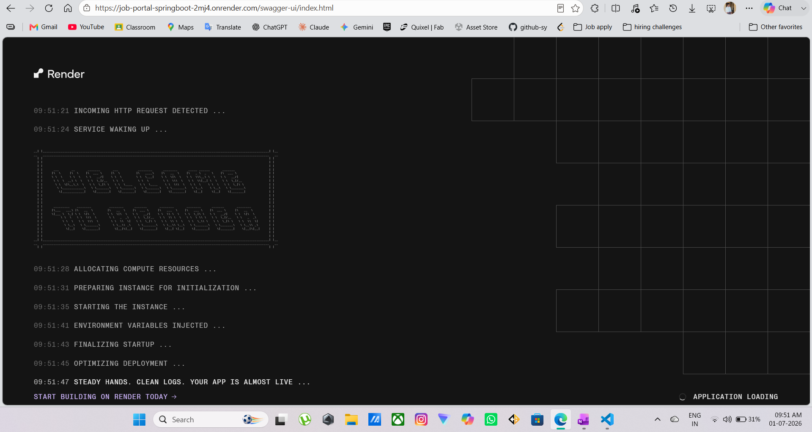

# Job Portal — Spring Boot REST API

[](https://github.com/sumityadav-sy/job-portal-springboot/actions/workflows/ci.yml)
[](https://openjdk.org/projects/jdk/21/)
[](https://spring.io/projects/spring-boot)
[](https://hub.docker.com/r/sumityadav26/jobportal)
[](https://job-portal-springboot-2mj4.onrender.com)

A production-style, fully deployed REST API for a job portal — recruiters post jobs, job seekers apply, and applications move through a status pipeline. Built to demonstrate real backend engineering practices: layered architecture, stateless JWT authentication, role-based authorization, a full automated test suite, containerization, and a CI/CD pipeline that ships straight to production.

**🔗 Live API:** https://job-portal-springboot-2mj4.onrender.com
**📘 Swagger UI:** https://job-portal-springboot-2mj4.onrender.com/swagger-ui/index.html

> ⚠️ **Cold start notice:** This is deployed on Render's free tier, which spins the service down after periods of inactivity. The **first request after idle can take 1–2 minutes** to wake the service — this is a hosting-tier limitation, not an application issue. Subsequent requests are fast. See the loading sequence Render shows during wake-up below.



---

## Table of Contents

- [Overview](#overview)
- [Tech Stack](#tech-stack)
- [Architecture](#architecture)
- [Security Model](#security-model)
- [API Reference](#api-reference)
- [Error Handling](#error-handling)
- [Testing](#testing)
- [Running Locally](#running-locally)
- [Docker](#docker)
- [CI/CD Pipeline](#cicd-pipeline)
- [Deployment](#deployment)
- [Project Structure](#project-structure)

---

## Overview

The portal supports two roles with distinct permissions:

- **JOB_SEEKER** — browse/search jobs, apply, view their own applications, withdraw an application (while still `APPLIED`)
- **RECRUITER** — post jobs, view/delete their own postings, review applications for their jobs, move applications through a status pipeline

Core domain rules enforced at the service layer:
- A job seeker can't apply twice to the same job
- A recruiter can't post a duplicate job (same title + company under their account)
- Only the recruiter who owns a job can update the status of applications to it
- Application status can only move forward through a defined pipeline (see [below](#application-status-pipeline)) — no arbitrary transitions
- A withdrawn application must still be in `APPLIED` status; you can't withdraw after a recruiter has acted on it

## Tech Stack

| Layer | Technology |
|---|---|
| Language / Runtime | Java 21 |
| Framework | Spring Boot 3.5.x |
| Persistence | Spring Data JPA / Hibernate |
| Database (prod) | MySQL 8 — hosted on **Aiven** (always-free tier) |
| Database (CI) | MySQL 8 service container |
| Database (tests) | H2 in-memory |
| Security | Spring Security, JWT (JJWT 0.11.5), BCrypt |
| Validation | Jakarta Bean Validation |
| API Docs | SpringDoc OpenAPI 2.8.9 (Swagger UI) |
| Testing | JUnit 5, Mockito, MockMvc, JaCoCo |
| Containerization | Docker (multi-stage build), Docker Compose |
| CI/CD | GitHub Actions |
| Image Registry | Docker Hub |
| Hosting | Render (free-tier web service) |

## Architecture

Standard layered architecture, one direction of dependency flow: `Controller → Service → Repository → Database`.

```
                        ┌─────────────────────┐
                        │   Client / Swagger   │
                        └──────────┬───────────┘
                                   │  HTTP + JWT (Bearer)
                                   ▼
                   ┌───────────────────────────────┐
                   │   JwtAuthenticationFilter      │  ← validates token, sets
                   │   (Spring Security chain)      │    SecurityContext
                   └───────────────┬────────────────┘
                                   ▼
                   ┌───────────────────────────────┐
                   │           Controllers          │  UserController
                   │  @PreAuthorize role checks     │  JobController
                   │                                 │  ApplicationController
                   └───────────────┬────────────────┘  AuthController
                                   ▼
                   ┌───────────────────────────────┐
                   │            Services             │  business rules,
                   │                                 │  ownership checks,
                   │                                 │  DTO ↔ entity mapping
                   └───────────────┬────────────────┘
                                   ▼
                   ┌───────────────────────────────┐
                   │          Repositories           │  Spring Data JPA
                   └───────────────┬────────────────┘
                                   ▼
                   ┌───────────────────────────────┐
                   │        MySQL (Aiven, SSL)       │
                   └───────────────────────────────┘
```

**Entity relationships:**
- `User (1) —— (*) Job` — a recruiter owns many jobs (`@OneToMany` / `@ManyToOne`)
- `User (1) —— (*) Application` — a job seeker owns many applications
- `Job (1) —— (*) Application` — a job receives many applications
- Both sides of the `User ↔ Job/Application` relationships are cascade-deleted, so removing a user cleans up their postings/applications

**DTO discipline:** Every entity has separate request and response DTOs. Passwords never leave the service layer — `UserResponseDTO` has no password field, and incoming registration/login DTOs are the only place a raw password ever appears in transit.

### Application Status Pipeline

```
APPLIED ──► REVIEWED ──► ACCEPTED   (final)
   │             │
   └──► REJECTED ┴──► REJECTED      (final)
```

Enforced in `ApplicationService.isValidTransition()` — `ACCEPTED` and `REJECTED` are terminal states with no further transitions allowed.

## Security Model

Stateless authentication via JWT — no server-side sessions.

1. **Login** (`POST /auth/login`) — credentials are verified by `AuthenticationManager`, which delegates to a custom `UserDetailsServiceImpl` and compares the submitted password against the BCrypt hash using `PasswordEncoder.matches()`.
2. **Token issuance** — on success, `JwtUtil` signs a token containing the user's email and role.
3. **Every subsequent request** carries the token as `Authorization: Bearer <token>`. `JwtAuthenticationFilter` runs once per request, validates the signature/expiry, and populates Spring Security's `SecurityContext` so `@PreAuthorize` and `@AuthenticationPrincipal` work downstream.
4. **Authorization** is layered two ways:
   - **Role-based**, via `@PreAuthorize("hasRole('RECRUITER')")` etc. on controller methods — blocks the wrong role before the method body even runs.
   - **Ownership-based**, inside the service layer — e.g. a recruiter can only update applications for jobs *they* posted; a job seeker can only withdraw *their own* application. This can't be expressed declaratively, so it's checked against the authenticated principal explicitly.
5. **Self-service deletion** — `DELETE /api/users/{id}` uses `@AuthenticationPrincipal` to resolve the calling user from the token, then the service checks that the caller is either deleting their own account or is a recruiter.

**Distinct 401 vs 403 handling** — deliberately not conflated:
- **401 Unauthorized** — no token, malformed token, or bad credentials at login (`BadCredentialsException`)
- **403 Forbidden** — valid token, wrong role or not the resource owner (`AccessDeniedException`, `UnauthorizedActionException`)

Each has its own handler in `GlobalExceptionHandler` so the client always gets an accurate status code, not a generic failure.

Passwords are hashed with BCrypt before storage — the raw password is never persisted or logged.

## API Reference

Base URL (local): `http://localhost:8080` · Base URL (live): `https://job-portal-springboot-2mj4.onrender.com`

Full interactive documentation, including request/response schemas and the ability to authenticate and try endpoints directly, is available on the live Swagger UI:
**https://job-portal-springboot-2mj4.onrender.com/swagger-ui/index.html**


### Auth

| Method | Endpoint | Auth | Description |
|---|---|---|---|
| POST | `/auth/login` | Public | Authenticate with email/password, returns a signed JWT |

### Users

| Method | Endpoint | Auth | Description |
|---|---|---|---|
| POST | `/api/users/register` | Public | Register a new user as `JOB_SEEKER` or `RECRUITER` |
| GET | `/api/users` | Authenticated | List all users |
| GET | `/api/users/{id}` | Authenticated | Get a user by ID |
| GET | `/api/users/role/{role}` | Authenticated | List users filtered by role |
| DELETE | `/api/users/{id}` | Authenticated (self or recruiter) | Delete a user account (cascades to their jobs/applications) |

### Jobs

| Method | Endpoint | Auth | Description |
|---|---|---|---|
| POST | `/jobs?recruiterId={id}` | RECRUITER | Post a new job listing |
| GET | `/jobs` | Public | List all jobs |
| GET | `/jobs/search?title=&location=&minSalary=` | Public | Search jobs by any combination of filters |
| GET | `/jobs/{id}` | Public | Get a job by ID |
| GET | `/jobs/recruiter/{recruiterId}` | Authenticated | List all jobs posted by a recruiter |
| DELETE | `/jobs/{id}` | RECRUITER | Delete a job (cascades to its applications) |

### Applications

| Method | Endpoint | Auth | Description |
|---|---|---|---|
| POST | `/applications?userId=&jobId=` | JOB_SEEKER | Apply for a job |
| PUT | `/applications/{id}/status?recruiterId=&status=` | RECRUITER (job owner only) | Move an application to `REVIEWED`, `ACCEPTED`, or `REJECTED` |
| GET | `/applications/user/{userId}` | JOB_SEEKER | Get all applications submitted by a job seeker |
| GET | `/applications/job/{jobId}` | RECRUITER | Get all applications received for a job |
| DELETE | `/applications/{id}?userId=` | JOB_SEEKER (applicant only) | Withdraw an application (only while `APPLIED`) |

## Error Handling

All errors return a consistent JSON shape via a centralized `@RestControllerAdvice`:

```json
{
  "status": 404,
  "error": "Not Found",
  "message": "Job not found with id: 42",
  "timestamp": "2026-07-01T10:15:30"
}
```

| Status | Trigger |
|---|---|
| 400 | Bean Validation failures, invalid path variable/enum values, invalid status transitions |
| 401 | Missing/invalid JWT, bad login credentials |
| 403 | Wrong role, or acting on a resource you don't own |
| 404 | User, job, or application not found |
| 409 | Duplicate email registration, duplicate job posting, duplicate application |
| 500 | Anything unhandled — deliberately generic, no stack traces leaked to the client |

## Testing

100 tests across service, controller, and repository layers, run against a real MySQL instance in CI.

| Layer | Test Class | Tests |
|---|---|---|
| Service | UserServiceTest | 10 |
| Service | JobServiceTest | 10 |
| Service | ApplicationServiceTest | 17 |
| Controller | UserControllerTest | 6 |
| Controller | JobControllerTest | 15 |
| Controller | ApplicationControllerTest | 17 |
| Controller | AuthControllerTest | 3 |
| Repository | UserRepositoryTest | 5 |
| Repository | JobRepositoryTest | 10 |
| Repository | ApplicationRepositoryTest | 6 |
| **Total** | | **100** |

**Results:** 0 failures · ~76% instruction coverage (JaCoCo)


**Tools:** JUnit 5 (runner/assertions) · Mockito (mocking service dependencies) · MockMvc (HTTP-level controller tests) · H2 (in-memory DB for repository tests) · JaCoCo (coverage)

```bash
mvn test
# Coverage report generated at: target/site/jacoco/index.html
```

**Notable test-isolation patterns used in this project:**
- `@DataJpaTest` silently swaps in an embedded datasource by default — `@AutoConfigureTestDatabase(replace = NONE)` is required wherever the real test config should apply
- `@ActiveProfiles("test")` prevents Spring from loading the main `application.properties` during tests

## Running Locally

**Prerequisites:** Java 21, Maven (or use the included wrapper), MySQL 8 (or Docker)

```bash
git clone https://github.com/sumityadav-sy/job-portal-springboot.git
cd job-portal-springboot

# configure environment variables (see .env.example / docker-compose.yml)
export DB_USERNAME=root
export DB_PASSWORD=yourpassword
export DB_NAME=jobportal
export JWT_SECRET=a-secret-key-at-least-32-characters-long

./mvnw spring-boot:run
```

The API will be available at `http://localhost:8080`, with Swagger UI at `http://localhost:8080/swagger-ui/index.html`.

## Docker

Multi-stage build — a Maven build stage produces the jar, and a slim `eclipse-temurin:21-jre-jammy` runtime stage runs it, keeping the final image lean.

**Run with Docker Compose** (spins up MySQL + the app together):

```bash
docker compose up --build
```

Docker Compose provisions a fresh MySQL container from the credentials in `.env` — these are independent of any local MySQL installation.

**Pull the production image directly:**

```bash
docker pull sumityadav26/jobportal:latest
```

Published to Docker Hub: [`sumityadav26/jobportal`](https://hub.docker.com/r/sumityadav26/jobportal) — tagged both `:latest` and `:sha-<commit>` on every push to `main`.

## CI/CD Pipeline

GitHub Actions workflow (`.github/workflows/ci.yml`) runs on every push/PR to `main`, in three sequential jobs:

```
   test  ──►  docker (build & push)  ──►  deploy (Render hook)
```

1. **`test`** — spins up a MySQL 8 service container, runs the full test suite against it (`mvn test`). Uses `127.0.0.1` rather than `localhost` for the datasource URL, since GitHub Actions service containers require TCP rather than a Unix socket.
2. **`docker`** — on success, builds the Docker image and pushes it to Docker Hub as both `latest` and `sha-<commit>`, giving every build a traceable, immutable tag alongside the rolling `latest`.
3. **`deploy`** — only on a push to `main`, triggers Render's deploy hook via a `curl` POST, which pulls the freshly pushed image and redeploys.

`paths-ignore` is configured so documentation-only changes (like README edits) don't trigger a full pipeline run.

## Deployment

| Component | Provider | Notes |
|---|---|---|
| Application | [Render](https://render.com) | Free-tier web service, deployed from Docker Hub image `sumityadav26/jobportal:latest` |
| Database | [Aiven](https://aiven.io) | MySQL 8.4, always-free tier, SSL required (`ssl-mode=REQUIRED`) |

**Why Render + Aiven instead of AWS:** AWS's free tier now requires a credit card and carries billing risk since its policy changed in July 2025. Render's free web-service tier and Aiven's always-free MySQL tier avoid that risk entirely, at the cost of a cold-start delay after idle — an acceptable tradeoff for a portfolio deployment.

**Cold start behavior:** the free Render instance spins down after inactivity. The first request after idle wakes the container, which takes roughly **1–2 minutes** — Render streams a live status log (`INCOMING HTTP REQUEST DETECTED... SERVICE WAKING UP...` etc.) while this happens. Once warm, response times are normal.

**Database credentials** are managed via environment variables (`DB_USERNAME`, `DB_PASSWORD`, `DB_NAME`, `JWT_SECRET`) — never committed to source control (`.env` is git-ignored).

## Project Structure

```
com.sumit.jobportal
├── entity        # User, Job, Application, enums (Role, ApplicationStatus)
├── repository     # Spring Data JPA repositories
├── service        # Business logic, ownership checks, DTO mapping
├── controller     # REST endpoints, @PreAuthorize role guards
├── dto            # Request/response DTOs, decoupled from entities
├── exception      # Typed exceptions + GlobalExceptionHandler
└── security       # JwtUtil, JwtAuthenticationFilter, SecurityConfig
```

---

<sub>Built by Sumit Yadav as a backend engineering portfolio project.</sub>
