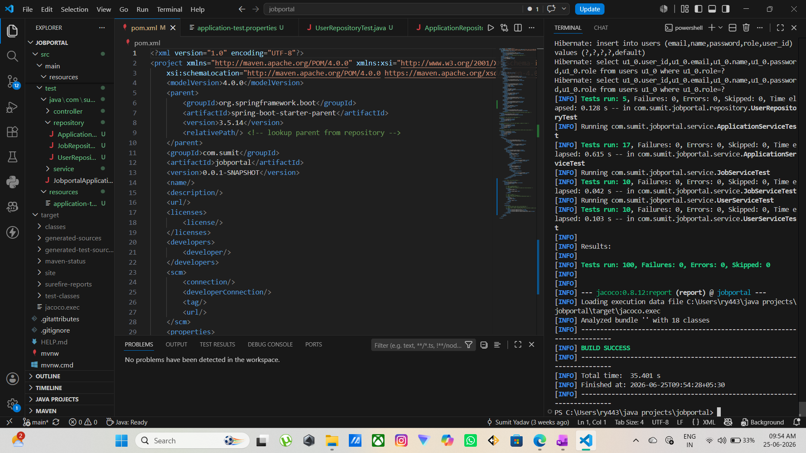
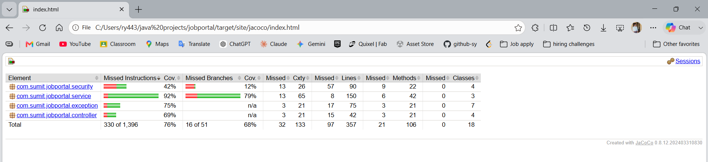

## Testing

This project has a comprehensive automated test suite covering the service, 
controller, and repository layers.

### Results
- **100 tests** across service, controller, and repository layers
- **0 failures**
- **76% code coverage** (JaCoCo)

### Test Results


### Coverage Report (JaCoCo)


### Test Breakdown

| Layer | Test Class | Tests |
|---|---|---|
| Service | UserServiceTest | 10 |
| Service | JobServiceTest | 10 |
| Service | ApplicationServiceTest | 17 |
| Controller | UserControllerTest | 6 |
| Controller | JobControllerTest | 15 |
| Controller | ApplicationControllerTest | 17 |
| Controller | AuthControllerTest | 3 |
| Repository | UserRepositoryTest | 5 |
| Repository | JobRepositoryTest | 10 |
| Repository | ApplicationRepositoryTest | 6 |
| **Total** | | **100** |

### How to Run Tests
```bash
mvn test
# Coverage report: target/site/jacoco/index.html
```

### Tools Used
- JUnit 5 — test runner and assertions
- Mockito — mocking dependencies in unit tests  
- MockMvc — HTTP-level integration testing
- H2 — in-memory database for repository tests
- JaCoCo — code coverage measurement