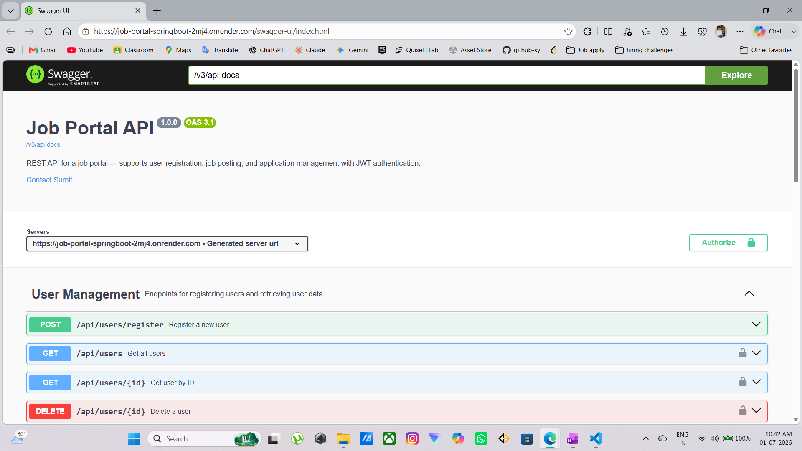

# Job Portal — Spring Boot REST API

[](https://github.com/sumityadav-sy/job-portal-springboot/actions/workflows/ci.yml)
[](https://openjdk.org/projects/jdk/21/)
[](https://spring.io/projects/spring-boot)
[](#security-model)
[](#testing)
[](#testing)
[-4479A1)](#deployment)
[](https://hub.docker.com/r/sumityadav26/jobportal)
[](https://job-portal-springboot-2mj4.onrender.com/swagger-ui/index.html)
[](https://job-portal-springboot-2mj4.onrender.com)

---
> A production-style, fully deployed REST API for a job portal — recruiters post jobs, job seekers apply, and applications move through a review pipeline.
>
> Built to demonstrate real backend engineering practices:
> - Layered architecture (Controller → Service → Repository)
> - Stateless JWT authentication with role- and ownership-based authorization
> - 100 automated tests across service, controller, and repository layers
> - Multi-stage Docker build + GitHub Actions CI/CD shipping straight to production
> - Live deployment on Render with a managed MySQL database on Aiven

---
🔗 **Live API:** https://job-portal-springboot-2mj4.onrender.com

📘 **Swagger UI:** https://job-portal-springboot-2mj4.onrender.com/swagger-ui/index.html

> ⚠️ **Cold start notice**
> This runs on Render's free tier, which spins the service down after periods of inactivity.
> - The **first request after idle takes ~1–2 minutes** to wake the service
> - This is a hosting-tier limitation, not an application issue
> - Subsequent requests are fast until it goes idle again
>

---

## Table of Contents

- [Overview](#overview)
- [Project Structure](#project-structure)
- [Tech Stack](#tech-stack)
- [Architecture](#architecture)
- [Security Model](#security-model)
- [API Reference](#api-reference)
- [Exception Handling](#exception-handling)
- [Testing](#testing)
- [Running Locally](#running-locally)
- [Docker](#docker)
- [CI/CD Pipeline](#cicd-pipeline)
- [Deployment](#deployment)


---

## Overview

The portal supports two roles with distinct permissions:

- **JOB_SEEKER** — browse/search jobs, apply, view their own applications, withdraw an application (while still `APPLIED`)
- **RECRUITER** — post jobs, view/delete their own postings, review applications for their jobs, move applications through a status pipeline

Core domain rules enforced at the service layer:
- A job seeker can't apply twice to the same job
- A recruiter can't post a duplicate job (same title + company under their account)
- Only the recruiter who owns a job can update the status of applications to it
- Application status can only move forward through a defined pipeline (see [below](#application-status-pipeline)) — no arbitrary transitions
- A withdrawn application must still be in `APPLIED` status; you can't withdraw after a recruiter has acted on it


---
## Project Structure

```
job-portal-springboot/
├── src/main/java/com/sumit/jobportal/
│   ├── controller/      # REST endpoints + @PreAuthorize role guards
│   ├── service/         # Business logic, ownership checks, DTO mapping
│   ├── repository/      # Spring Data JPA interfaces (DB queries)
│   ├── entity/          # JPA entities: User, Job, Application + enums
│   ├── dto/             # Request/Response DTOs — entities never exposed directly
│   ├── security/        # JWT filter, SecurityConfig, UserDetailsServiceImpl
│   ├── exception/       # Custom exceptions + GlobalExceptionHandler
│   └── config/          # OpenAPI / Swagger configuration
├── src/main/resources/
│   └── application.properties      # DB, JPA, JWT config
├── src/test/                        # JUnit 5 + Mockito + MockMvc + H2 tests
├── .github/workflows/ci.yml         # CI/CD — test → Docker build → Render deploy
├── Dockerfile                       # Multi-stage build (Maven builder + JRE runtime)
├── docker-compose.yml               # Local dev — app + MySQL containers
└── pom.xml
```

## Tech Stack

| Layer | Technology |
|---|---|
| Language / Runtime | Java 21 |
| Framework | Spring Boot 3.5.x |
| Persistence | Spring Data JPA / Hibernate |
| Database (prod) | MySQL 8 — hosted on **Aiven** (always-free tier) |
| Database (CI) | MySQL 8 service container |
| Database (tests) | H2 in-memory |
| Security | Spring Security, JWT (JJWT 0.11.5), BCrypt |
| Validation | Jakarta Bean Validation |
| API Docs | SpringDoc OpenAPI 2.8.9 (Swagger UI) |
| Testing | JUnit 5, Mockito, MockMvc, JaCoCo |
| Containerization | Docker (multi-stage build), Docker Compose |
| CI/CD | GitHub Actions |
| Image Registry | Docker Hub |
| Hosting | Render (free-tier web service) |

---

## Architecture

Standard layered architecture, one direction of dependency flow: `Controller → Service → Repository → Database`.

```
                        ┌─────────────────────┐
                        │   Client / Swagger  │
                        └──────────┬──────────┘
                                   │  HTTP + JWT (Bearer)
                                   ▼
                   ┌────────────────────────────────┐
                   │   JwtAuthenticationFilter      │  ← validates token, sets                             |
                   │   (Spring Security chain)      │    SecurityContext
                   └───────────────┬────────────────┘
                                   ▼
                   ┌────────────────────────────────┐
                   │           Controllers          │  UserController
                   │  @PreAuthorize role checks     │  JobController
                   │                                │         ApplicationController            |
                   └───────────────┬────────────────┘  AuthController
                                   ▼
                   ┌────────────────────────────────┐
                   │            Services            │  business rules,
                   │                                │  ownership checks,
                   │                                │  DTO ↔ entity mapping
                   └───────────────┬────────────────┘
                                   ▼
                   ┌────────────────────────────────┐
                   │          Repositories          │  Spring Data JPA
                   └───────────────┬────────────────┘
                                   ▼
                   ┌────────────────────────────────┐
                   │        MySQL (Aiven, SSL)      │
                   └────────────────────────────────┘
```


### Entity Relationships

The domain has three entities connected by two `@OneToMany` / `@ManyToOne` relationships:

- **`User (1) —── (*) Job`** — one recruiter can post many jobs; each job belongs to exactly one recruiter
- **`User (1) —── (*) Application`** — one job seeker can submit many applications; each application belongs to exactly one applicant
- **`Job (1) —── (*) Application`** — one job can receive many applications; each application points to exactly one job

**Cascade behavior:** both `User → Job` and `User → Application` are configured with `cascade = CascadeType.ALL`. Deleting a user automatically deletes everything that depends on them — a deleted recruiter's job postings (and, transitively, applications to those jobs) are removed, and a deleted job seeker's applications are removed. No orphaned records are left behind.

### DTO Layer

Every entity has dedicated request/response DTOs — the JPA entities themselves are never exposed directly over the API. This keeps the wire format decoupled from the database schema and guarantees sensitive fields (like passwords) can never leak into a response.

| DTO | Purpose |
|---|---|
| `UserRequestDTO` | Incoming payload for user registration — name, email, password, role |
| `UserResponseDTO` | Outgoing user data — deliberately excludes the password field entirely |
| `LoginRequestDTO` | Incoming payload for `/auth/login` — email + password |
| `JobRequestDTO` | Incoming payload for posting a job — title, company, location, salary, description |
| `JobResponseDTO` | Outgoing job data — flattens in the recruiter's name/email instead of nesting the full `User` object |
| `ApplicationResponseDTO` | Outgoing application data — flattens applicant, job, and recruiter details into one flat object for the client |

**Why this matters:** a raw password only ever exists in transit inside `UserRequestDTO` / `LoginRequestDTO` on the way *in* — it's hashed with BCrypt before it touches the database, and no response DTO in the project carries a password field. This is enforced structurally, not just by convention: since `UserResponseDTO` has no password property, there's no code path that could accidentally serialize one into a response.

### Application Status Pipeline

Every application starts at `APPLIED` and can only move forward — never sideways or backward — through a fixed set of transitions:

```
APPLIED ──► REVIEWED ──► ACCEPTED     (final state)
   │             │
   └───────► REJECTED ◄──┘            (final state)
```

- **`APPLIED`** — initial state, set automatically when a job seeker applies
- **`REVIEWED`** — the recruiter has looked at the application; from here it can move to `ACCEPTED` or `REJECTED`
- **`ACCEPTED`** — final state, no further transitions allowed
- **`REJECTED`** — final state, reachable directly from `APPLIED` or from `REVIEWED`; no further transitions allowed

This is enforced in `ApplicationService.isValidTransition()`, which checks the current status against the requested next status before allowing an update — a recruiter can't skip straight from `APPLIED` to `ACCEPTED`, and nothing can move out of `ACCEPTED` or `REJECTED` once it lands there. An invalid transition returns a `400 Bad Request` rather than silently applying.

## Security Model

The API uses **stateless JWT-based authentication** — no sessions, no cookies, no server-side state. Every request is self-contained and verified independently using a signed token.

### Security Tech Stack

| Component | Technology | Role |
|---|---|---|
| Security Framework | Spring Security 6 | Filter chain, context management, method-level guards |
| Token Standard | JWT (JSON Web Token) | Stateless auth token carrying email + role |
| JWT Library | JJWT 0.11.5 (`jjwt-api`, `jjwt-impl`, `jjwt-jackson`) | Token signing, parsing, and validation |
| Password Hashing | BCrypt (`BCryptPasswordEncoder`) | One-way hash stored in DB — raw password never persisted |
| Auth Entry Point | `HttpStatusEntryPoint` (401) | Returns structured 401 when no/invalid token is present |
| Access Denied Handler | Custom `AccessDeniedHandler` (403) | Returns structured 403 when role check fails |
| Exception Handler | `GlobalExceptionHandler` (`@RestControllerAdvice`) | Converts all security exceptions to consistent JSON error responses |

---
### Security Features

-  Stateless authentication — no server-side session state
-  JWT tokens signed with a secret key (configured via `JWT_SECRET` env variable)
-  Tokens carry the user's email and role — no extra DB call needed per request
-  BCrypt password hashing — brute-force resistant, salt included automatically
-  Role-based access control via `@PreAuthorize` on every protected endpoint
-  Ownership-based authorization enforced at the service layer (beyond what roles alone can express)
-  Distinct 401 vs 403 responses — never conflated
-  Public endpoints (`/auth/login`, `GET /jobs`, `POST /api/users/register`) explicitly whitelisted — everything else requires a valid token
-  Password never appears in any response DTO — excluded structurally, not by convention

### Authentication & Authorization Flow

```
  Client
    │
    │  POST /auth/login  { email, password }
    ▼
┌──────────────────────────────────────────────┐
│  AuthController                              │
│    └─► AuthenticationManager.authenticate()  │
│           └─► UserDetailsServiceImpl         │  loads user from DB by email                                          |
│                  └─► BCrypt.matches()        │  compares raw vs stored hash                                           |
└──────────────┬───────────────────────────────┘
               │ success                │ failure
               ▼                        ▼
        JwtUtil.generateToken()    BadCredentialsException
        { email, role }  →  JWT         │
               │                        ▼
               │              GlobalExceptionHandler
               │                → 401 Unauthorized
               ▼
        { "token": "eyJhbG..." }   ← returned to client


  ── Every subsequent request ──────────────────────────────

  Client sends:  Authorization: Bearer eyJhbG...
    │
    ▼
┌───────────────────────────────────────────────┐
│  JwtAuthenticationFilter (runs per request)   │
│    1. Extract token from Authorization header │
│    2. Validate signature + expiry             │
│    3. Parse email + role from claims          │
│    4. Set Authentication in SecurityContext   │
└──────────────┬────────────────────────────────┘
               │ valid token           │ invalid / missing token
               ▼                       ▼
    Controller method               HttpStatusEntryPoint
               │                    → 401 Unauthorized
               ▼
    @PreAuthorize("hasRole(...)")
               │ role matches          │ role mismatch
               ▼                       ▼
    Service layer                  AccessDeniedException
               │                    → 403 Forbidden
               ▼
    Ownership check
    (e.g. "is this your job?")
               │ owner matches         │ not the owner
               ▼                       ▼
    Business logic runs         UnauthorizedActionException
                                    → 403 Forbidden
```

### Authorization Layers

Authorization is enforced at **two distinct layers** — neither can be bypassed independently:

**Layer 1 — Role-based (Controller)**
- `@PreAuthorize("hasRole('RECRUITER')")` / `@PreAuthorize("hasRole('JOB_SEEKER')")` on controller methods
- Evaluated by Spring Security before the method body runs
- If the role doesn't match → `AccessDeniedException` → `403 Forbidden` immediately

**Layer 2 — Ownership-based (Service)**
- Role alone isn't enough for operations like updating an application status or withdrawing an application
- The service layer resolves the authenticated user's identity and checks that they own the resource
- Examples: a recruiter can only update applications for *their own* jobs; a job seeker can only withdraw *their own* applications
- Violations throw `UnauthorizedActionException` → `403 Forbidden`

### 401 vs 403 — Never Conflated

A common mistake in REST APIs is returning 403 for everything auth-related. This project deliberately distinguishes them:

| Status | Meaning | When it's thrown |
|---|---|---|
| **401 Unauthorized** | You are not authenticated | No token, malformed token, expired token, wrong password at login |
| **403 Forbidden** | You are authenticated but not allowed | Valid token but wrong role, or valid role but not the resource owner |

Each has its own dedicated handler in `GlobalExceptionHandler` — the client always receives the semantically correct status code and a structured JSON error body.

---

## API Reference

| | |
|---|---|
| **Local Base URL** | `http://localhost:8080` |
| **Live Base URL** | `https://job-portal-springboot-2mj4.onrender.com` |
| **Interactive Docs** | https://job-portal-springboot-2mj4.onrender.com/swagger-ui/index.html |



### How to Use the API (Swagger UI)

Most endpoints require a JWT token. Follow these steps to authenticate and start making requests in Swagger UI:

**Step 1 — Register a user**
- Expand `POST /api/users/register` → click **Try it out**
- Submit a request body with `name`, `email`, `password`, and `role` (`JOB_SEEKER` or `RECRUITER`)
- This endpoint is public — no token needed

**Step 2 — Get your JWT token**
- Expand `POST /auth/login` → click **Try it out**
- Submit your registered `email` and `password`
- Copy the `token` value from the response — it looks like `eyJhbGciOiJIUzI1NiJ9...`

**Step 3 — Authorize in Swagger UI**
- Click the **Authorize ** button at the top right of the Swagger UI page
- In the `Value` field, type: `Bearer <your-token>` (include the word `Bearer` followed by a space)
- Click **Authorize**, then **Close**
- All subsequent requests in the UI will now include your token automatically

**Step 4 — Try protected endpoints**
- Endpoints marked `RECRUITER` (e.g. `POST /jobs`) require a token from a `RECRUITER` account
- Endpoints marked `JOB_SEEKER` (e.g. `POST /applications`) require a token from a `JOB_SEEKER` account
- Using the wrong role returns a `403 Forbidden`
- Making any request without a token returns a `401 Unauthorized`

>  **Tip:** Register two accounts (one `JOB_SEEKER`, one `RECRUITER`), get both tokens, and switch between them in the Authorize dialog to test both sides of the API.

### Auth

| Method | Endpoint | Auth | Description |
|---|---|---|---|
| POST | `/auth/login` | Public | Authenticate with email/password, returns a signed JWT |

### Users

| Method | Endpoint | Auth | Description |
|---|---|---|---|
| POST | `/api/users/register` | Public | Register a new user as `JOB_SEEKER` or `RECRUITER` |
| GET | `/api/users` | Authenticated | List all users |
| GET | `/api/users/{id}` | Authenticated | Get a user by ID |
| GET | `/api/users/role/{role}` | Authenticated | List users filtered by role |
| DELETE | `/api/users/{id}` | Authenticated (self or recruiter) | Delete a user account (cascades to their jobs/applications) |

### Jobs

| Method | Endpoint | Auth | Description |
|---|---|---|---|
| POST | `/jobs?recruiterId={id}` | RECRUITER | Post a new job listing |
| GET | `/jobs` | Public | List all jobs |
| GET | `/jobs/search?title=&location=&minSalary=` | Public | Search jobs by any combination of filters |
| GET | `/jobs/{id}` | Public | Get a job by ID |
| GET | `/jobs/recruiter/{recruiterId}` | Authenticated | List all jobs posted by a recruiter |
| DELETE | `/jobs/{id}` | RECRUITER | Delete a job (cascades to its applications) |

### Applications

| Method | Endpoint | Auth | Description |
|---|---|---|---|
| POST | `/applications?userId=&jobId=` | JOB_SEEKER | Apply for a job |
| PUT | `/applications/{id}/status?recruiterId=&status=` | RECRUITER (job owner only) | Move an application to `REVIEWED`, `ACCEPTED`, or `REJECTED` |
| GET | `/applications/user/{userId}` | JOB_SEEKER | Get all applications submitted by a job seeker |
| GET | `/applications/job/{jobId}` | RECRUITER | Get all applications received for a job |
| DELETE | `/applications/{id}?userId=` | JOB_SEEKER (applicant only) | Withdraw an application (only while `APPLIED`) |

## Exception Handling

All errors across the entire API — validation failures, auth errors, not-found cases, business rule violations — are handled in one place: `GlobalExceptionHandler`, a `@RestControllerAdvice` class. No controller or service ever returns a raw error string or lets an exception propagate unhandled to the client.

### Consistent Error Response Shape

Every error, regardless of type, returns the same JSON structure:

```json
{
  "status": 404,
  "error": "Not Found",
  "message": "Job not found with id: 42",
  "timestamp": "2026-07-01T10:15:30"
}
```

| Field | Type | Description |
|---|---|---|
| `status` | `int` | HTTP status code (e.g. 404) |
| `error` | `String` | Standard HTTP reason phrase (e.g. "Not Found") |
| `message` | `String` | Human-readable explanation specific to what went wrong |
| `timestamp` | `LocalDateTime` | When the error occurred — captured at construction time in `ApiError` |

This shape is defined in `ApiError.java` and constructed inside each exception handler method.

### Custom Exception Hierarchy

All domain exceptions extend a common base class `JobPortalException`, which carries both the message and the HTTP status it maps to. This means each exception type knows its own status code — the handler just reads it out.

```
RuntimeException
    └── JobPortalException          (base — carries HttpStatus)
            ├── ResourceNotFoundException       → 404 Not Found
            ├── DuplicateResourceException      → 409 Conflict
            ├── InvalidInputException           → 400 Bad Request
            └── UnauthorizedActionException     → 403 Forbidden
```

| Exception | Status | When it's thrown |
|---|---|---|
| `ResourceNotFoundException` | 404 | User, job, or application not found by ID |
| `DuplicateResourceException` | 409 | Email already registered, job already posted (same title+company), or already applied to a job |
| `InvalidInputException` | 400 | Invalid status transition (e.g. `APPLIED → ACCEPTED` directly) or business rule violation |
| `UnauthorizedActionException` | 403 | Correct role but wrong ownership — e.g. updating another recruiter's application, withdrawing someone else's application |

### Exception Handlers in `GlobalExceptionHandler`

The handler class has a dedicated `@ExceptionHandler` method for every exception type — nothing is caught generically and re-labelled:

| Handler | Exception Caught | Status |
|---|---|---|
| `handleNotFound` | `ResourceNotFoundException` | 404 |
| `handleUnauthorized` | `UnauthorizedActionException` | 403 |
| `handleDuplicate` | `DuplicateResourceException` | 409 |
| `handleInvalidInput` | `InvalidInputException` | 400 |
| `handleValidationErrors` | `MethodArgumentNotValidException` | 400 |
| `handleTypeMismatch` | `MethodArgumentTypeMismatchException` | 400 |
| `handleBadCredentials` | `BadCredentialsException` | 401 |
| `handleAccessDenied` | `AccessDeniedException` | 403 |
| `handleGenericException` | `Exception` (catch-all) | 500 |

### How the Exception Flow Works

```
HTTP Request
    │
    ▼
Spring Security Filter Chain
    │  invalid/missing token → HttpStatusEntryPoint → 401
    │  role mismatch → AccessDeniedException ───────────────┐
    ▼                                                       │
Controller method                                           │
    │  @PreAuthorize fails → AccessDeniedException ─────────┤
    ▼                                                       │
Service layer                                               │
    │  resource not found → ResourceNotFoundException       │
    │  duplicate → DuplicateResourceException               │
    │  bad input → InvalidInputException                    │
    │  wrong owner → UnauthorizedActionException ───────────┤
    ▼                                                       │
Repository / DB                                             │
    │  unexpected failure → Exception (catch-all)           │
    ▼                                                       │
GlobalExceptionHandler (@RestControllerAdvice) ◄────────────┘
    │
    │  Wraps in ApiError { status, error, message, timestamp }
    ▼
JSON Error Response to Client
```

### Notable Handler Details

**Bean Validation (`MethodArgumentNotValidException`)** — thrown automatically by Spring when `@Valid` on a request body fails. The handler collects all field-level errors from `getBindingResult().getFieldErrors()` and joins them into a single comma-separated message, so the client sees all validation failures in one response rather than one at a time.

**Path Variable Type Mismatch (`MethodArgumentTypeMismatchException`)** — thrown when a `@PathVariable` can't be converted to the expected type. For example, `/api/users/role/RECRUIT` (not a valid `Role` enum value) returns `400` with a message like `Invalid value 'RECRUIT' for parameter 'role'` rather than a cryptic 500.

**Bad Credentials (`BadCredentialsException`)** — thrown by Spring's `AuthenticationManager` when login credentials don't match. The handler deliberately returns a vague message (`"Invalid email or password"`) — it doesn't tell the caller whether the email or password was wrong, to avoid giving attackers information about which accounts exist.

**Catch-all (`Exception`)** — any exception not covered by a specific handler lands here and returns a generic `500 Internal Server Error` with the message `"An unexpected error occurred"`. Stack traces are never exposed to the client.

## Testing

This project has a comprehensive automated test suite covering the service, 
controller, and repository layers.
### Results
- **100 tests** across service, controller, and repository layers
- **0 failures**
- **76% code coverage** (JaCoCo)
### Test Results

### Coverage Report (JaCoCo)

### Test Breakdown
| Layer | Test Class | Tests |
|---|---|---|
| Service | UserServiceTest | 10 |
| Service | JobServiceTest | 10 |
| Service | ApplicationServiceTest | 17 |
| Controller | UserControllerTest | 6 |
| Controller | JobControllerTest | 15 |
| Controller | ApplicationControllerTest | 17 |
| Controller | AuthControllerTest | 3 |
| Repository | UserRepositoryTest | 5 |
| Repository | JobRepositoryTest | 10 |
| Repository | ApplicationRepositoryTest | 6 |
| **Total** | | **100** |
### How to Run Tests
```bash
mvn test
# Coverage report: target/site/jacoco/index.html
```
### Tools Used
- JUnit 5 — test runner and assertions
- Mockito — mocking dependencies in unit tests  
- MockMvc — HTTP-level integration testing
- H2 — in-memory database for repository tests
- JaCoCo — code coverage measurement


**Notable test-isolation patterns used in this project:**
- `@DataJpaTest` silently swaps in an embedded datasource by default — `@AutoConfigureTestDatabase(replace = NONE)` is required wherever the real test config should apply
- `@ActiveProfiles("test")` prevents Spring from loading the main `application.properties` during tests

## Running Locally

**Prerequisites:** Java 21, Maven (or use the included wrapper), MySQL 8 (or Docker)

```bash
git clone https://github.com/sumityadav-sy/job-portal-springboot.git
cd job-portal-springboot

# configure environment variables (see .env.example / docker-compose.yml)
export DB_USERNAME=root
export DB_PASSWORD=yourpassword
export DB_NAME=jobportal
export JWT_SECRET=a-secret-key-at-least-32-characters-long

./mvnw spring-boot:run
```

The API will be available at `http://localhost:8080`, with Swagger UI at `http://localhost:8080/swagger-ui/index.html`.

## Docker

### Image Design — Multi-Stage Build

The `Dockerfile` uses two stages to keep the final image small and production-clean:

- **Stage 1 (`builder`)** — uses `maven:3.9.6-eclipse-temurin-21` to compile the project and produce the fat jar (`mvn clean package -DskipTests`)
- **Stage 2 (runtime)** — uses `eclipse-temurin:21-jre-jammy` (JRE only, no JDK or Maven) — copies just the jar from Stage 1
- Result: a lean ~157 MB image with no build tools included

### Running with Docker Compose (Local Dev)

Docker Compose starts both the app and a MySQL 8 container together — no local MySQL installation needed:

```bash
# 1. Create a .env file in the project root with these variables:
DB_USERNAME=jobportal_user
DB_PASSWORD=yourpassword
DB_NAME=jobportal
JWT_SECRET=a-secret-key-at-least-32-characters-long

# 2. Start everything
docker compose up --build
```

- MySQL starts first; the app waits for a health check (`mysqladmin ping`) before starting
- App is available at `http://localhost:8080`
- MySQL data persists in a named Docker volume (`mysql_data`) between restarts
- Credentials in `.env` are invented for the container — not tied to any local MySQL accounts

### Docker Hub

The production image is published to Docker Hub on every successful CI run:

```bash
docker pull sumityadav26/jobportal:latest
```

- **`:latest`** — always points to the most recent build from `main`
- **`:sha-<commit>`** — immutable tag per commit, useful for rollbacks
- Registry: [`hub.docker.com/r/sumityadav26/jobportal`](https://hub.docker.com/r/sumityadav26/jobportal)

## CI/CD Pipeline

Every push or pull request to `main` triggers the GitHub Actions workflow (`.github/workflows/ci.yml`). Three jobs run sequentially — each only starts if the previous one passed:

```
push to main
     │
     ▼
┌─────────────┐     ┌──────────────────────┐     ┌──────────────────┐
│    test     │────►│  docker (build+push) │────►│  deploy (Render) │
│  (MySQL CI) │     │    (Docker Hub)      │     │  (deploy hook)   │
└─────────────┘     └──────────────────────┘     └──────────────────┘
```

### Job 1 — `test`

- Spins up a **MySQL 8 service container** inside the GitHub Actions runner
- Sets `SPRING_DATASOURCE_URL` to `jdbc:mysql://127.0.0.1:3306/...` — uses `127.0.0.1` not `localhost`, because GHA service containers require TCP and `localhost` tries a Unix socket
- Injects `JWT_SECRET` as an environment variable so security config initializes correctly
- Runs `mvn test` — all 100 tests must pass before the next job runs

### Job 2 — `docker`

- Runs only if `test` passed
- Logs into Docker Hub using `DOCKER_USERNAME` and `DOCKER_TOKEN` secrets
- Builds the multi-stage Docker image from the repo root
- Pushes two tags to `sumityadav26/jobportal`:
  - `:latest` — rolling tag, always the freshest build
  - `:sha-<commit>` — immutable per-commit tag for traceability and rollback

### Job 3 — `deploy`

- Runs only on a **push to `main`** (not on PRs) and only if `docker` passed
- Fires a `curl -X POST` to Render's deploy hook URL (stored as `RENDER_DEPLOY_HOOK` secret)
- Render pulls the freshly pushed `:latest` image and redeploys the live service automatically

### Other Details

- **`paths-ignore`** is configured — pushing README or doc changes alone does not trigger the pipeline
- All secrets (`DOCKER_USERNAME`, `DOCKER_TOKEN`, `JWT_SECRET`, `RENDER_DEPLOY_HOOK`) are stored in GitHub repository secrets, never in source code

## Deployment

### Infrastructure

| Component | Provider | Details |
|---|---|---|
| Application | [Render](https://render.com) | Free-tier web service, pulls from `sumityadav26/jobportal:latest` on Docker Hub |
| Database | [Aiven](https://aiven.io) | MySQL 8.4.8, always-free tier, hosted on DigitalOcean Amsterdam |

### Application — Render

- Deployed as a **Docker image-based web service** (not a Git deploy — Render pulls from Docker Hub)
- Render redeploys automatically when the CI/CD pipeline fires the deploy hook after a successful push to `main`
- Port `8080` is exposed; Render maps it to HTTPS with a managed TLS certificate
- Environment variables (`DB_USERNAME`, `DB_PASSWORD`, `DB_NAME`, `JWT_SECRET`) are configured in Render's dashboard — never in source code

### Database — Aiven MySQL

- **MySQL 8.4.8** hosted on DigitalOcean Amsterdam (always-free tier, no credit card required)
- SSL connection required (`ssl-mode=REQUIRED`) — enforced by Aiven, configured in `application.properties`
- Connection string injected via environment variables at runtime

### Why Render + Aiven instead of AWS

- AWS's free tier now requires a credit card and carries billing risk (policy changed July 2025)
- Render's free web-service tier and Aiven's always-free MySQL tier are genuinely free with no billing surprises
- Tradeoff: Render free tier spins down after inactivity — first request takes ~1–2 minutes to wake the service

### Credentials & Secrets

- `.env` is git-ignored — never committed
- Local dev credentials live in `.env`, read by Docker Compose
- Production credentials set as environment variables in Render's dashboard
- CI secrets (`DOCKER_TOKEN`, `RENDER_DEPLOY_HOOK`, `JWT_SECRET`) stored in GitHub repository secrets

---

<sub>Built by Sumit Yadav as a backend engineering portfolio project.</sub>

## Author

**Sumit Yadav**

---

## License

This project is licensed under the MIT License - see the LICENSE file for details.

MIT License © 2026 [Sumit Yadav]

This project is licensed under the [MIT License](./LICENSE).
---

